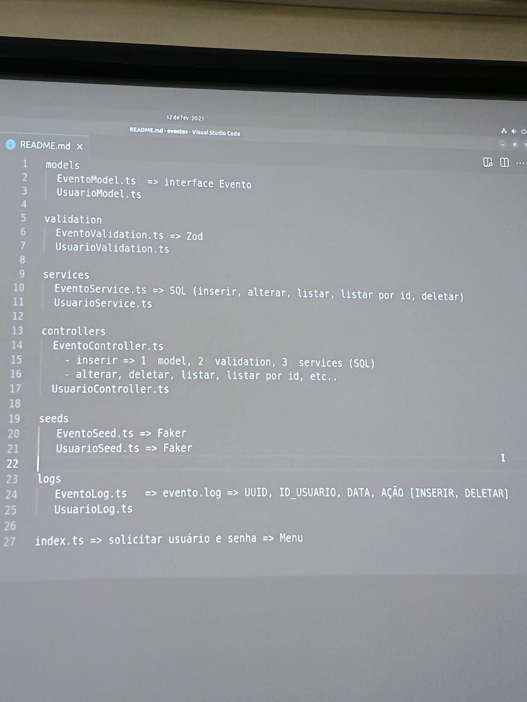

# Sistema de Gerenciamento de Eventos em TypeScript

Este é um projeto de exemplo para gerenciar eventos, usuários e logs em **TypeScript**, utilizando um banco de dados **SQLite** sem expor nenhuma API externa (sem uso de HTTP). A aplicação é estruturada em diferentes camadas, utilizando controllers para validação e manipulação dos dados, um serviço para gestão dos logs e uma camada de banco de dados responsável pela criação das tabelas. Todas as operações podem ser realizadas diretamente por meio das funções disponibilizadas pelo projeto.

## Sumário
- [Funcionalidades](#funcionalidades)
- [Pré-requisitos](#pré-requisitos)
- [Instalação](#instalação)
- [Estrutura do Projeto](#estrutura-do-projeto)
- [Como Executar](#como-executar)
- [Exemplos de Uso](#exemplos-de-uso)
- [Licença](#licença)


## Funcionalidades
- **Criação de Tabelas:** Inicializa as tabelas necessárias para armazenar dados de usuários, eventos e logs.
- **Usuários:**
  - Inserção de novos usuários (com validação dos dados).
  - Listagem de todos os usuários cadastrados.
  - Consulta de usuário específico por ID.
  - Exclusão de usuário mediante validação.
- **Eventos:**
  - Adição de eventos associados a usuários.
  - Listagem de todos os eventos.
  - Consulta de evento específico por ID.
  - Exclusão de evento, verificando relacionamento com o usuário.
- **Logs:**
  - Registro e consulta dos logs de operações realizadas no sistema.

## Pré-requisitos
- Node.js (recomendado: versão 14 ou superior)
- npm ou yarn para gerenciamento de pacotes

## Instalação
1. Clone o repositório:
   git clone https://github.com/YurizinDEV/gerenciadorEventos.git

2. Entre no diretório do projeto:
   cd gerenciadorEventos

3. Instale as dependências:
   npm install
   ou
   yarn install

## Estrutura do Projeto
- **models/**
  - Contém as definições dos modelos de dados que representam as entidades do sistema, tais como:
     - Usuário: Define atributos como id, nome, email e senha.
     - Evento: Define atributos como id, nome, data e a referência ao usuário (usuario_id) responsável pelo evento.
     - Log: Armazena informações sobre as operações realizadas, facilitando o rastreamento e auditoria do sistema.
- **database/**
  - Contém o módulo responsável pela criação das tabelas (ex.: createTable.js), que inicializa as estruturas no banco de dados.
- **controllers/**
  - userController.js: Gerencia as operações relacionadas aos usuários, como inserção, listagem, consulta por ID e deleção.
  - eventController.js: Gerencia as operações relacionadas aos eventos, incluindo adição, listagem, consulta por ID e deleção.
- **services/**
  - logService.js: Responsável por listar e gerenciar logs das operações realizadas.
- **index.js**
  - Arquivo principal que orquestra a execução das funções, simulando operações do sistema.

## Como Executar
Este projeto utiliza TypeScript. Para facilitar o desenvolvimento, o script "npm run dev" utiliza o nodemon para monitorar alterações e reiniciar o servidor automaticamente.

### Opção 1: Desenvolvimento com nodemon
Utilize o script de desenvolvimento:

   npm run dev

Esse comando executará o arquivo index.ts com nodemon e ts-node, permitindo que alterações nos arquivos TypeScript sejam automaticamente refletidas sem a necessidade de reiniciar o servidor manualmente.

### Opção 2: Execução Direta com ts-node
Se preferir, você pode executar diretamente utilizando ts-node:

   ts-node index.ts  
ou  
   npx ts-node index.ts

Ao executar, o sistema realizará as seguintes operações:
1. Cria as tabelas de usuários, eventos e logs.
2. Insere dois usuários de exemplo.
3. Lista todos os usuários.
4. Consulta um usuário específico (por ID).
5. Exclui um usuário.
6. Adiciona um evento associado a um usuário específico.
7. Lista todos os eventos.
8. Consulta e exclui um evento específico.
9. Exibe os logs das operações realizadas.

## Exemplos de Uso
O código presente no arquivo `index.ts` exemplifica como utilizar cada funcionalidade do sistema. Um resumo das operações realizadas:

```typescript
// Criação das tabelas
criarTabelas();

// Inserção dos usuários com dados validados pelo controller
inserirUsuarioController({ nome: "João Silva", email: "joao@example.com", senha: "123456" });
inserirUsuarioController({ nome: "Maria Silva", email: "maria@example.com", senha: "123456" });

// Listagem de todos os usuários cadastrados
listarTodosUsuariosController();

// Consulta de usuário por ID
listarUsuarioPorIdController(1);

// Exclusão de usuário
deletarUsuarioController(1);

// Adição de evento associado ao usuário
adicionarEventoController({ nome: "Evento de Teste", data: "2025-03-01", usuario_id: 1 });

// Listagem de todos os eventos cadastrados
listarTodosEventosController();

// Consulta e exclusão de evento por ID
listarEventoPorIdController(1);
deletarEventoController({ id: 1, usuario_id: 1 });

// Listagem dos logs registrados
listarLogsService();
```

## Licença

Este projeto está sob a [MIT License](https://opensource.org/licenses/MIT).  
Sinta-se à vontade para usar, modificar e compartilhar.



